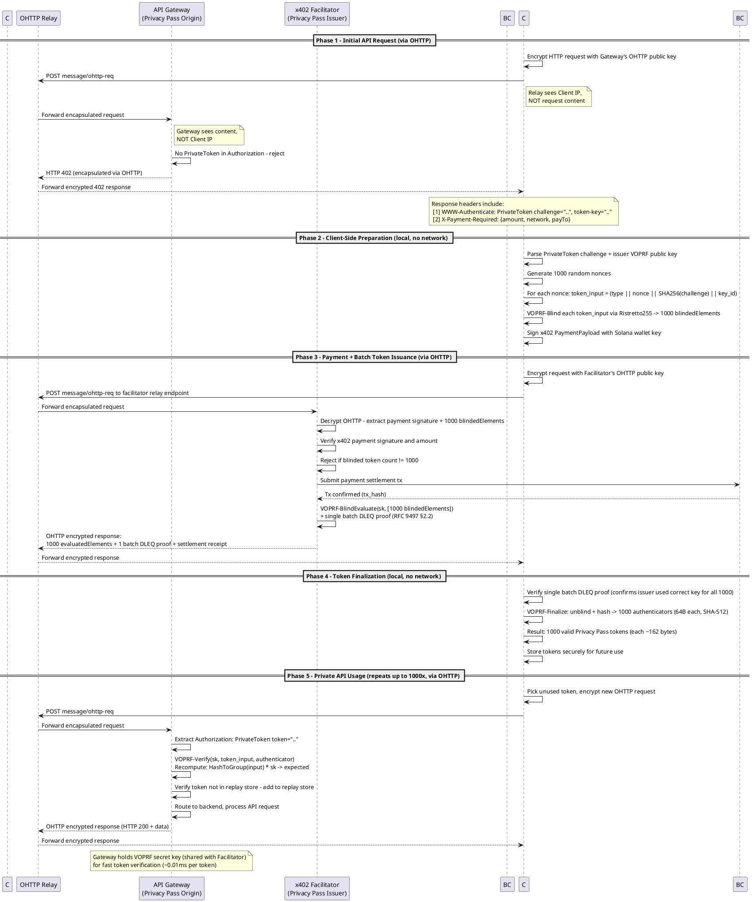

# Architecture

## Overview

The Private Payments Gateway enables fully private API consumption. Three complementary privacy standards ensure no single entity can build a complete profile of the user:

- **OHTTP (RFC 9458)** — hides client IP from servers via encrypted relay
- **Privacy Pass (RFC 9576-9578)** — provides unlinkable authorization tokens via blind signatures
- **x402v2** — enables permissionless HTTP-native payments without accounts

## Entities

| Entity | Role | Learns | Does NOT Learn |
|--------|------|--------|----------------|
| **Client** | API consumer, token holder | Own requests, tokens, payment | — |
| **OHTTP Relay** | Encrypted message forwarder | Client IP, request timing/sizes | Request content, payment data, tokens |
| **API Gateway** | API service, token validator | Request content, redeemed tokens | Client IP, payment data, token-to-payment mapping |
| **x402 Facilitator** | Payment processor, token issuer | Payment data, blinded token requests | Client IP, unblinded tokens, API request content |
| **Blockchain** | Payment settlement | Tx sender/amount/recipient | Client IP, API usage, token data |

**Key unlinkability**: The Facilitator sees payments but can't link them to API usage (blind signatures). The Gateway sees usage but can't link it to payments or identity (OHTTP + unlinkable tokens). No entity holds all three pieces.

## Protocol Flow



## Phase Details

### Phase 1 — Discovery (Client -> API Gateway via OHTTP)

The client makes an initial API request routed through an OHTTP relay. The relay encrypts the transport so the API Gateway never learns the client's IP. The Gateway finds no `PrivateToken` in the `Authorization` header and returns **HTTP 402** with:

- **`WWW-Authenticate: PrivateToken`** — Privacy Pass challenge (token type 0x0001 = privately verifiable VOPRF) and the Facilitator's Ristretto255 public key
- **`X-Payment-Required`** — x402v2 payment requirements: price, blockchain network, recipient wallet

### Phase 2 — Preparation (Client-side only, no network)

The client prepares two things locally:

1. **1000 blinded token requests** — For each, generates a random 32-byte nonce, constructs `token_input = (type || nonce || challenge_digest || key_id)`, hashes to a Ristretto255 group element via `HashToGroup()`, and applies VOPRF blinding (random scalar multiplication). Each `blindedElement` is 32 bytes.

2. **Signed x402 payment** — The client signs a `PaymentPayload` with their Solana wallet key, authorizing payment of the required amount.

### Phase 3 — Payment + Issuance (Client -> Facilitator via OHTTP)

The client sends both the signed payment and the 1000 blinded elements to the Facilitator through OHTTP. The Facilitator:

1. Verifies the x402 payment signature and amount
2. Confirms exactly 1000 blinded elements are included
3. Settles the payment on Solana Devnet
4. Calls `VOPRFServer.blindEvaluate(evalReq)` on all 1000 blinded elements in a single batch
5. Generates a single DLEQ proof covering all 1000 evaluations (RFC 9497 section 2.2)
6. Returns 1000 `evaluatedElement` values + 1 batch DLEQ proof + settlement receipt

The Facilitator never sees the actual token values — only blinded group elements. It cannot later recognize these tokens when they're redeemed.

### Phase 4 — Finalization (Client-side only, no network)

The client verifies the batch DLEQ proof (confirming the Facilitator used the correct secret key for all 1000), then unblinds each evaluated element and computes the VOPRF output: `authenticator = SHA-512(token_input || unblindedElement)`. Each token is 162 bytes: `token_type (2B) || nonce (32B) || challenge_digest (32B) || token_key_id (32B) || authenticator (64B)`.

### Phase 5 — Private API Usage (up to 1000 requests, via OHTTP)

For each API call, the client:

1. Selects an unused token from local storage
2. Wraps the request in a fresh OHTTP encapsulation (new HPKE context each time)
3. Sends via relay to the API Gateway
4. The Gateway recomputes the VOPRF output and compares against the token's authenticator (~0.01ms)
5. Checks the replay store, then processes the request

Each request uses a different token and a different OHTTP encryption context, so the Gateway cannot correlate requests.

## Request Routing

All requests from the CLI go through OHTTP to preserve privacy. The relay supports a `?target=` query parameter to route to different backends (gateway vs facilitator). Inside Docker, the relay maps ports to service hostnames:

| Client target | Relay forwards to |
|---------------|-------------------|
| `localhost:3001` | `gateway:3001` |
| `localhost:3002` | `facilitator:3002` |

```
Client                      Relay                      Gateway/Facilitator
  |                          |                              |
  |-- OHTTP(encapsulate) -->|                              |
  |                          |-- POST /?target=gateway --->|
  |                          |                              |-- decapsulate
  |                          |                              |-- process request
  |                          |<-- OHTTP(encapsulate) ------|
  |<-- decrypt -------------|                              |
```

## Design Decisions

### VOPRF on Ristretto255 (Type 1 / Privately Verifiable)

Token type 0x0001 with VOPRF `Ristretto255-SHA512` ciphersuite (RFC 9497). Ristretto255 scalar multiplication is ~100x faster than RSA-2048, and tokens are 162 bytes vs 354 bytes with RSA.

Tokens are privately verifiable, requiring the API Gateway to share the VOPRF secret key with the Facilitator. This creates a single trust domain. Cryptographic unlinkability is preserved — the Facilitator sees only blinded elements and cannot recognize unblinded tokens.

Production alternative: **Blind Schnorr signatures** would provide public verification, no key sharing, ~64-byte tokens, and collusion resistance, but is not yet a standardized Privacy Pass token type.

### Client-to-Facilitator Direct Payment

In standard x402, the resource server forwards payment to the facilitator. Here, the client pays the Facilitator directly through OHTTP to keep the Gateway unaware of payment details and to return tokens directly to the client.

### Atomic Payment + Issuance

Payment and token issuance happen in a single request. The Facilitator rejects if the client doesn't include exactly 1000 blinded elements, preventing payment without tokens or tokens without payment.

## Privacy Analysis

| Threat | Mitigation |
|--------|------------|
| API Gateway identifies client by IP | OHTTP relay hides client IP |
| API Gateway links requests to same client | Each Privacy Pass token is cryptographically unlinkable |
| Facilitator links payment to API usage | VOPRF blind signatures — sees only blinded elements |
| Facilitator identifies client by IP | OHTTP relay hides client IP |
| Relay correlates client to API usage | Relay sees encrypted blobs only — no request content |
| Blockchain analysis links wallet to API | Wallet visible on-chain but not connected to IP or tokens |
| Token replay | Gateway maintains in-memory replay store, rejects duplicates |
| OHTTP request size fingerprinting | BHTTP padding (RFC 9458 section 7) mitigates size analysis |

**Residual risks** (noted for production hardening):
- Timing correlation by relay (mitigated by batching/jitter)
- Gateway + Facilitator collusion enables behavioral (not cryptographic) correlation
- Blockchain wallet analysis (mitigated by fresh wallets or mixing)
