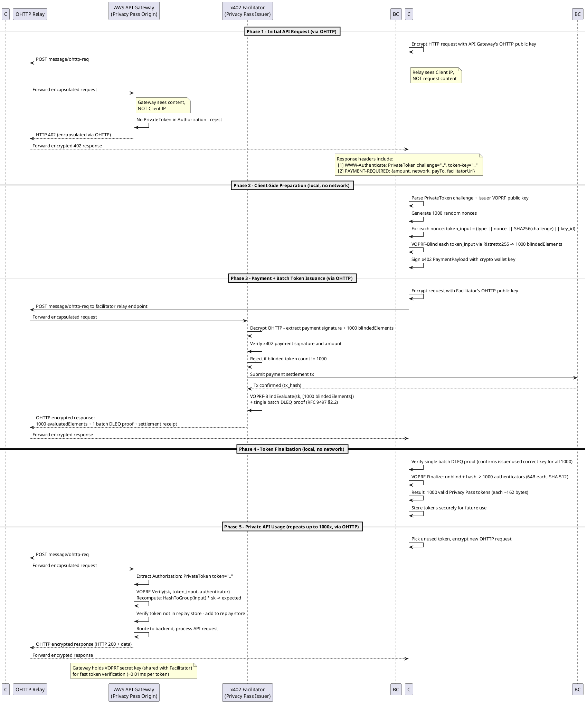

# Private Payments Gateway — Protocol Design & PRD

## Context

**Problem**: API consumers today must expose their identity (IP address, payment credentials, API keys) to use commercial APIs. This creates a linkable trail between who pays, who requests, and what they request.

**Goal**: Enable fully private API consumption where:
- The API provider cannot identify who is making requests
- The payment processor cannot link payments to API usage
- No single entity can build a complete profile of the user

**Approach**: Combine three complementary privacy standards:
- **OHTTP (RFC 9458)** — Hides client IP from servers via encrypted relay
- **Privacy Pass (RFC 9576–9578)** — Provides unlinkable authorization tokens via blind signatures
- **x402v2** — Enables permissionless HTTP-native payments without accounts

---

## Entities

| Entity | Role | Privacy Pass Role | Learns | Does NOT Learn |
|--------|------|-------------------|--------|----------------|
| **Client** | API consumer, token holder | Client | Own requests, tokens, payment | — |
| **OHTTP Relay** | Encrypted message forwarder | — | Client IP, request timing/sizes | Request content, payment data, tokens |
| **AWS API Gateway** | API service, token validator | Origin | Request content, redeemed tokens | Client IP, payment data, token-to-payment mapping |
| **x402 Facilitator** | Payment processor, token issuer | Issuer | Payment data, blinded token requests | Client IP, unblinded tokens, API request content |
| **Blockchain** | Payment settlement | — | Tx sender/amount/recipient | Client IP, API usage, token data |

**Key unlinkability**: The Facilitator sees payments but can't link them to API usage (blind signatures). The API Gateway sees usage but can't link it to payments or identity (OHTTP + unlinkable tokens). No entity holds all three pieces.

---

## Protocol Flow — Swim Lane Diagram (PlantUML)



---

## Protocol Flow Summary

### Phase 1 — Discovery (Client ↔ API Gateway via OHTTP)

The client makes an initial API request routed through an OHTTP relay. The relay encrypts the transport so the API Gateway never learns the client's IP. The Gateway finds no `PrivateToken` in the `Authorization` header and returns **HTTP 402** with two key headers:

- **`WWW-Authenticate: PrivateToken`** — Contains a Privacy Pass challenge (token type 0x0001 = privately verifiable VOPRF) and the Facilitator's Ristretto255 public key
- **`PAYMENT-REQUIRED`** — Contains x402v2 payment requirements: price, blockchain network, recipient wallet, and the Facilitator's endpoint URL

### Phase 2 — Preparation (Client-side only)

The client prepares two things locally with no network calls:

1. **1000 blinded token requests** — For each, generates a random 32-byte nonce, constructs the token input (type ‖ nonce ‖ challenge_digest ‖ key_id), hashes it to a Ristretto255 group element via `HashToGroup()`, and applies VOPRF blinding (random scalar multiplication). Each `blindedElement` is 32 bytes (compressed Ristretto255 point).

2. **Signed x402 payment** — The client signs a `PaymentPayload` with their Solana wallet key, authorizing payment of the required amount.

### Phase 3 — Payment + Issuance (Client ↔ Facilitator via OHTTP)

The client sends both the signed payment and the 1000 blinded elements to the Facilitator through OHTTP (hiding their IP). The Facilitator:

1. Verifies the x402 payment signature and amount
2. Confirms exactly 1000 blinded elements are included (rejects otherwise)
3. Settles the payment on Solana Devnet
4. Calls `VOPRFServer.blindEvaluate(evalReq)` on all 1000 blinded elements in a single batch — one Ristretto255 scalar multiplication per element (~100x faster than RSA)
5. The batch evaluation generates a single DLEQ proof covering all 1000 evaluations (RFC 9497 §2.2 composite proof)
6. Returns 1000 `evaluatedElement` values + 1 batch DLEQ proof + settlement receipt

The Facilitator never sees the actual token values — only blinded group elements. It cannot later recognize these tokens when they're redeemed.

### Phase 4 — Finalization (Client-side only)

The client verifies the single batch DLEQ proof (confirming the Facilitator used the correct secret key for all 1000 evaluations), then unblinds each evaluated element and computes the VOPRF output: `authenticator = SHA-512(token_input ‖ unblindedElement)`. Each token contains: `token_type (2B) ‖ nonce (32B) ‖ challenge_digest (32B) ‖ token_key_id (32B) ‖ authenticator (64B)` = **162 bytes** per token (vs 354 bytes with RSA).

### Phase 5 — Private API Usage (up to 1000 requests)

For each API call, the client:
1. Selects an unused token from local storage
2. Wraps the request in a fresh OHTTP encapsulation (new HPKE context each time)
3. Sends via relay to the API Gateway
4. The Gateway recomputes the VOPRF output: `HashToGroup(token_input) * sk`, hashes it, and compares against the token's authenticator. Verification is ~0.01ms per token.
5. Checks the replay store, then processes the request

Each request uses a different token and a different OHTTP encryption context, so the Gateway cannot correlate requests to each other or to the original payment.

---

## Key Design Decisions

### 1. VOPRF on Ristretto255 (Type 1 / Privately Verifiable)

Using token_type 0x0001 with VOPRF `Ristretto255-SHA512` ciphersuite (RFC 9497) for performance. Ristretto255 scalar multiplication is ~100x faster than RSA-2048 operations, and tokens are less than half the size (162B vs 354B).

**Trust model tradeoff**: Tokens are privately verifiable, requiring the API Gateway to share the VOPRF secret key with the Facilitator. This creates a single trust domain between Gateway and Facilitator.

**Cryptographic unlinkability is preserved**: The Facilitator sees blinded elements (`B = r * H(token_input)`) during issuance but cannot recognize unblinded tokens during redemption. The client's blinding factor `r` is never shared.

**Collusion risk**: If Gateway and Facilitator share data, they can correlate via timing and volume analysis (e.g., "payment at 14:32:05, requests began at 14:32:10"). This is not cryptographic linking, but behavioral inference.

**Production alternative — Blind Schnorr signatures**: A publicly-verifiable scheme would eliminate key sharing and collusion risks entirely. Blind Schnorr on Ristretto255 would provide:
- Public verification (no key sharing required)
- Fast verification (~0.02ms per token)
- Compact tokens (~64 bytes vs 162B for VOPRF, 354B for RSA)
- Collusion-proof: even if Gateway + Facilitator share data, they cannot link tokens to issuance

However, Blind Schnorr is not yet a standardized Privacy Pass token type (not in RFC 9578, only exists as an IETF draft). For PoC, VOPRF is the pragmatic choice; production should track `draft-irtf-cfrg-blind-signatures` and consider implementation once standardized.

### 2. Client-to-Facilitator Direct Payment

In standard x402, the resource server forwards payment to the facilitator. Here, the client pays the Facilitator directly (via OHTTP) because:
- The client must send blinded token data, which the API Gateway shouldn't see
- The Facilitator must return signed tokens directly to the client
- This keeps the API Gateway completely unaware of payment details

### 3. Atomic Payment + Issuance

The payment and token issuance happen in a single request-response. The Facilitator rejects the payment if the client doesn't include exactly 1000 valid blinded token requests. This prevents payment without token issuance and vice versa.

### 4. OHTTP on Both Channels

Both the API Gateway and Facilitator communications go through OHTTP relays, ensuring neither server learns the client's IP address. Combined with Privacy Pass unlinkability, this means no server can build a profile of the client.

---

## Privacy Guarantee Analysis

| Threat | Mitigation |
|--------|------------|
| API Gateway identifies client by IP | OHTTP relay hides client IP |
| API Gateway links requests to same client | Each Privacy Pass token is cryptographically unlinkable |
| Facilitator links payment to API usage | VOPRF blind signatures — Facilitator sees only blinded elements |
| Facilitator identifies client by IP | OHTTP relay hides client IP |
| Relay correlates client to API usage | Relay sees encrypted blobs only — no request content |
| Blockchain analysis links wallet to API | Wallet is visible on-chain but not connected to IP or API tokens |
| OHTTP Gateway fingerprints via request size | Binary HTTP padding (RFC 9458 §7) mitigates size analysis |
| Token replay | Gateway maintains token replay store, rejects duplicates |
| Gateway + Facilitator collusion | **Not mitigated in PoC** — timing/volume correlation possible; production would require publicly-verifiable scheme (Blind Schnorr) |

**Residual risks** (noted, not fully mitigated in PoC):
- Timing correlation by relay (mitigated by batching/jitter in production)
- Blockchain wallet analysis (mitigated by using fresh wallets or mixing in production)
- OHTTP key consistency (clients must verify keys out-of-band per RFC 9458 §7)
- Gateway + Facilitator collusion enabling timing correlation (mitigated by using publicly-verifiable tokens in production)

---

## Resolved Design Decisions

- **Blockchain**: Solana Devnet (fast settlement, free test tokens)
- **Client**: Node.js CLI tool
- **OHTTP Relay**: Cloudflare privacy-gateway-relay (https://github.com/cloudflare/privacy-gateway-relay)
- **Token scope**: Cross-origin (one token works for any endpoint behind the gateway)
- **Blind signature scheme**: VOPRF on Ristretto255 (`Ristretto255-SHA512` ciphersuite, RFC 9497) — ~100x faster than RSA, 162B tokens vs 354B. Gateway shares VOPRF secret key with Facilitator for verification. **Tradeoff**: Gateway + Facilitator form single trust domain; collusion enables timing correlation. Production should use publicly-verifiable scheme (Blind Schnorr) once standardized.

---

## Implementation Plan

### Project Structure

```
private-payments-gateway/
├── package.json                    # Root workspace config
├── tsconfig.base.json              # Shared TS config
├── turbo.json                      # Build orchestration
├── packages/
│   ├── shared/                     # @ppg/shared
│   │   └── src/
│   │       ├── index.ts
│   │       ├── crypto/
│   │       │   ├── privacypass.ts  # Privacy Pass framing on @cloudflare/voprf-ts (Ristretto255-SHA512)
│   │       │   └── ohttp.ts        # OHTTP encap/decap (Phase 5)
│   │       └── types/
│   │           ├── x402.ts         # Re-exports from @x402/core + custom IssueRequest/IssueResponse
│   │           └── protocol.ts     # Shared request/response types
│   ├── facilitator/                # @ppg/facilitator
│   │   └── src/
│   │       ├── index.ts            # Express app (port 3002)
│   │       ├── routes/
│   │       │   ├── issue.ts        # POST /issue — payment + batch token issuance
│   │       │   └── token-key.ts    # GET /token-key — issuer public key
│   │       ├── services/
│   │       │   ├── payment.ts      # x402 payment verification + Solana settlement
│   │       │   ├── issuer.ts       # Wraps voprf-ts VOPRFServer for batch VOPRF evaluation
│   │       │   └── key-manager.ts  # VOPRF key pair management
│   │       └── config.ts
│   ├── gateway/                    # @ppg/gateway
│   │   └── src/
│   │       ├── index.ts            # Express app (port 3001)
│   │       ├── middleware/
│   │       │   └── auth.ts         # Combined PrivateToken verify / 402 response
│   │       ├── services/
│   │       │   ├── verifier.ts     # Wraps voprf-ts VOPRFServer for token verification
│   │       │   └── replay-store.ts # In-memory token replay prevention
│   │       └── routes/
│   │           └── api.ts          # Protected API endpoints
│   └── cli/                        # @ppg/cli
│       └── src/
│           ├── index.ts            # CLI entry (commander.js)
│           ├── commands/
│           │   ├── request.ts      # Full flow: request → 402 → pay → tokens → request
│           │   ├── buy-tokens.ts   # Buy tokens explicitly
│           │   └── balance.ts      # Show token balance
│           └── services/
│               ├── token-store.ts  # File-based token storage (~/.ppg/tokens.json)
│               ├── client.ts       # Wraps voprf-ts VOPRFClient for batch blinding/finalization
│               ├── payment.ts      # Solana payment construction + signing
│               └── ohttp-client.ts # OHTTP request wrapper (Phase 5)
├── scripts/
│   ├── setup-keys.ts               # Generate VOPRF + OHTTP keys
│   ├── fund-wallet.ts              # Airdrop SOL on devnet
│   └── e2e-test.ts                 # End-to-end integration test
└── relay/                          # Cloudflare privacy-gateway-relay config
```

### Dependencies

| Package | Used In | Purpose |
|---------|---------|---------|
| `@cloudflare/voprf-ts` | shared | VOPRF protocol (RFC 9497) — batch blind evaluation + batch DLEQ proofs |
| `@noble/curves` | shared | Ristretto255 CryptoProvider for voprf-ts (`CryptoNoble`) |
| `@noble/hashes` | shared | SHA-256, SHA-512 |
| `@x402/core` | shared, facilitator, cli | x402v2 types and schemas (PaymentRequirements, PaymentPayload, etc.) |
| `@x402/svm` | facilitator, cli | Solana-specific x402 payment verification and settlement |
| `@solana/kit` | facilitator, cli | Solana transactions, signing, RPC |
| `@solana-program/token` | facilitator | SPL token transfer verification |
| `@scure/base` | shared | Base58, base64url encoding |
| `express` | facilitator, gateway | HTTP servers |
| `commander` | cli | CLI argument parsing |
| `@hpke/core` | shared (Phase 5) | HPKE encryption for OHTTP |
| `@hpke/dhkem-x25519` | shared (Phase 5) | X25519 KEM for OHTTP cipher suite |
| `zod` | shared | Runtime type validation |
| `vitest` | all | Testing |
| `tsx` | all | TypeScript execution |
| `turbo` | root | Monorepo build orchestration |

### Build Order

```
Phase 0: Monorepo scaffolding
    ↓
Phase 1: @ppg/shared — types + crypto primitives + encoding
    ↓
Phase 2: @ppg/facilitator — blind signing + payment (mock first, then Solana)
    ↓
Phase 3: @ppg/gateway — token verification + 402 responses
    ↓
Phase 4: @ppg/cli — full client flow
    ↓
Phase 5: OHTTP layer — encrypt transport on both channels
    ↓
Phase 6: E2E testing + Solana Devnet integration
```

---

### Phase 0 — Monorepo Scaffolding

Create root `package.json` with `"workspaces": ["packages/*"]`, `tsconfig.base.json` (target ES2022, module NodeNext, strict), `turbo.json` with build pipeline. Each package gets its own `package.json` and `tsconfig.json` extending the base.

**Verify**: `npm install && npx turbo build` succeeds with all four packages.

---

### Phase 1 — Shared Crypto & Types (`@ppg/shared`)

Uses `@cloudflare/voprf-ts` for the VOPRF cryptographic protocol with custom Privacy Pass framing (~300-400 lines) on top:

```typescript
// packages/shared/src/crypto/privacypass.ts
// Privacy Pass protocol framing on @cloudflare/voprf-ts (Ristretto255-SHA512)
import { Oprf, VOPRFClient, VOPRFServer, generateKeyPair, Evaluation, EvaluationRequest, FinalizeData } from '@cloudflare/voprf-ts';
import { CryptoNoble } from '@cloudflare/voprf-ts/cryptoNoble.js';

const SUITE = Oprf.Suite.RISTRETTO255_SHA512;

// --- Key Management ---
export async function voprfKeyGen() {
  return generateKeyPair(SUITE, CryptoNoble);
}

// --- Issuer (Facilitator-side) ---
export function createVOPRFServer(privateKey: Uint8Array) {
  return new VOPRFServer(SUITE, privateKey, CryptoNoble);
}

// Batch evaluate 1000 blinded elements with single DLEQ proof
export async function batchIssue(server: VOPRFServer, evalReq: EvaluationRequest) {
  const evaluation = await server.blindEvaluate(evalReq);
  // evaluation.evaluated = 1000 evaluated elements
  // evaluation.proof = 1 batch DLEQ proof (RFC 9497 §2.2)
  return evaluation;
}

// --- Client (CLI-side) ---
export function createVOPRFClient(publicKey: Uint8Array) {
  return new VOPRFClient(SUITE, publicKey, CryptoNoble);
}

// Batch blind 1000 token inputs in one call
export async function batchBlind(client: VOPRFClient, tokenInputs: Uint8Array[]) {
  const [finData, evalReq] = await client.blind(tokenInputs);
  // finData holds client state for later finalization
  // evalReq.blinded = 1000 blinded elements
  return { finData, evalReq };
}

// Verify single batch proof + unblind all 1000 tokens
export async function batchFinalize(client: VOPRFClient, finData: FinalizeData, evaluation: Evaluation) {
  return client.finalize(finData, evaluation);
  // Returns Uint8Array[] — 1000 VOPRF outputs (authenticators)
}

// --- Privacy Pass Token Framing (RFC 9578) ---
// AuthenticatorInput: token_type(2B) || nonce(32B) || challenge_digest(32B) || token_key_id(32B)
// Token: AuthenticatorInput || authenticator(64B) = 162 bytes
// TokenChallenge, Token, serialize/deserialize per RFC 9578 §5
// ~200 additional lines for wire format handling
```

The `@cloudflare/voprf-ts` library handles:
- **Key generation** — `generateKeyPair(suite)` produces VOPRF key pair
- **Batch blinding** — `client.blind(inputs[])` blinds all token inputs at once, returns paired state + request
- **Batch evaluation** — `server.blindEvaluate(evalReq)` evaluates all blinded elements, generates single DLEQ proof
- **Batch finalization** — `client.finalize(finData, evaluation)` verifies single proof, unblinds all tokens
- **Serialization** — `EvaluationRequest`, `Evaluation` have `.serialize()` / `.deserialize()`

Custom Privacy Pass framing (~300-400 lines) handles:
- **Token structure** — `AuthenticatorInput` construction per RFC 9578 §5 (nonce, challenge digest, key ID)
- **Token challenge** — `TokenChallenge` creation and serialization
- **Wire format** — `BatchedTokenRequest` / `BatchedTokenResponse` encoding
- **Token verification** — Recompute VOPRF output from token input + secret key, compare authenticator

Reference implementation: `privacypass-ts/src/priv_verif_token.ts` (~200 lines of framing on the same `voprf-ts` library, but hardcoded to P-384).

**Types** (`packages/shared/src/types/x402.ts`):

```typescript
// Re-export from @x402/core — no custom types needed for standard x402
export { PaymentRequirements, PaymentPayload } from '@x402/core/types';

// Custom types for our Privacy Pass + x402 integration
export interface IssueRequest {
  paymentPayload: PaymentPayload;
  blindedElements: string[];  // base64url-encoded blinded Ristretto255 points
}

export interface IssueResponse {
  evaluatedElements: string[];  // base64url-encoded evaluated points
  proof: string;                // base64url-encoded single batch DLEQ proof
  settlement: { success: boolean; transaction: string; network: string };
}
```

**Verify**: Unit test for full VOPRF cycle using voprf-ts (`VOPRFClient.blind` → `VOPRFServer.blindEvaluate` → `VOPRFClient.finalize` with Ristretto255-SHA512), plus Privacy Pass framing round-trip (construct token → serialize → deserialize → verify).

---

### Phase 2 — Facilitator Service (`@ppg/facilitator`)

Express server on port 3002 with two routes:

**`POST /issue`** — The core novel endpoint:

1. Parse `IssueRequest` body (payment payload + base64url-encoded blinded elements)
2. Validate exactly 1000 blinded elements present → reject otherwise
3. Verify and settle x402 payment via `@x402/svm` (mock initially, Solana Devnet in Phase 6)
4. Deserialize blinded elements, call `server.blindEvaluate(evalReq)` — voprf-ts evaluates all 1000 elements and generates a single batch DLEQ proof (RFC 9497 §2.2)
5. Return `IssueResponse` with 1000 evaluated elements + 1 batch proof + settlement receipt

**`GET /token-key`** — Returns issuer's Ristretto255 public key (32 bytes, `application/octet-stream`)

**Services**:
- `KeyManager` — Loads/generates VOPRF key pair via `generateKeyPair(Oprf.Suite.RISTRETTO255_SHA512)`, persists to disk
- `Issuer` — Wraps `VOPRFServer` for batch issuance (single `blindEvaluate()` call for 1000 tokens)
- `PaymentService` — Phase 2 uses mock (always succeeds); Phase 6 adds real Solana settlement via `@x402/svm`

**Verify**: POST to `/issue` with crafted blinded elements → verify response contains 1000 evaluated elements that finalize into valid tokens.

---

### Phase 3 — API Gateway Service (`@ppg/gateway`)

Express server on port 3001 that protects all API routes behind Privacy Pass auth.

**Middleware (`auth.ts`)** — Single middleware that handles both paths:

- If `Authorization: PrivateToken token="..."` present → deserialize token (custom Privacy Pass framing), recompute VOPRF output via `VOPRFServer.verifyFinalize()`, compare authenticator, check replay store → 200 (pass to route handler) or 401
- If no Authorization header → return 402 with:
  - `WWW-Authenticate: PrivateToken challenge="base64url(TokenChallenge)", token-key="base64url(issuer_pk)"`
  - `PAYMENT-REQUIRED: base64(JSON PaymentRequirements)`

**Services**:
- `TokenVerifier` — Wraps `VOPRFServer.verifyFinalize()` for token validation (recomputes `HashToGroup(token_input) * sk` and compares authenticator)
- `ReplayStore` — In-memory `Set<string>` keyed by hex-encoded nonce (production: Redis/DynamoDB)

**Routes**: Sample protected endpoints (`/weather`, `/quote`) returning mock data.

**Verify**: Hit `/weather` with no auth → 402. Hit with valid token → 200. Replay same token → 401.

---

### Phase 4 — CLI Client (`@ppg/cli`)

Commander.js CLI with three commands:

**`ppg request <url>`** — Full automated flow:

1. Check `TokenStore` for available tokens
2. If token available → make request with `Authorization: PrivateToken token="..."`
3. If no tokens → hit URL, get 402
4. Parse `WWW-Authenticate` and `PAYMENT-REQUIRED` headers
5. Create VOPRF client: `const client = createVOPRFClient(issuerPublicKey)`
6. Construct 1000 token inputs (nonce, challenge digest, key ID per RFC 9578)
7. Batch blind all 1000 inputs: `const { finData, evalReq } = await batchBlind(client, tokenInputs)` — single call
8. `PaymentClient.createPayment(requirements)` → constructs Solana transfer tx via `@x402/svm`, partially signs
9. POST `IssueRequest` to facilitator's `/issue` (serialized blinded elements + payment)
10. Deserialize response, call `batchFinalize(client, finData, evaluation)` — verifies single batch DLEQ proof, unblinds all 1000 tokens
11. Construct final tokens (token_input ‖ authenticator), store, use first for original request

**`ppg buy-tokens`** — Explicitly purchase tokens without making an API call

**`ppg balance`** — Show remaining token count

**Services**:
- `TokenStore` — File-based (`~/.ppg/tokens.json`), FIFO consumption
- `PPGClient` — Wraps `VOPRFClient` for batch blinding (`client.blind(inputs[])`) and finalization (`client.finalize(finData, evaluation)`)
- `PaymentClient` — Constructs SPL token transfer via `@x402/svm` (USDC on Solana Devnet)

**Verify**: Full manual test — run facilitator + gateway, execute `ppg request http://localhost:3001/weather`, observe 402 → payment → 1000 tokens → 200 response.

---

### Phase 5 — OHTTP Layer

Add encrypted transport to both Gateway and Facilitator channels using HPKE.

**Approach**: Minimal OHTTP implementation (~300 lines) using `@hpke/core` + `@hpke/dhkem-x25519` rather than depending on `ohttp-js` (which is Deno-first and may have Node.js compatibility issues). Implement the BHTTP subset we need (non-chunked request/response encoding per RFC 9292).

**Server side** — Express middleware that:
1. Checks for `Content-Type: message/ohttp-req`
2. HPKE-decrypts the encapsulated request body
3. Decodes the BHTTP request
4. Makes a local HTTP request to the same Express app (bypassing OHTTP layer)
5. Encodes + encrypts the response as `message/ohttp-res`

**Client side** — Wrapper around `fetch()` that:
1. Fetches gateway's OHTTP public key config from `/ohttp-keys`
2. BHTTP-encodes the request
3. HPKE-encrypts using gateway's public key
4. POSTs to relay URL as `message/ohttp-req`
5. Decrypts + decodes the response

**Local relay** — Simple Express proxy (15 lines) on port 3000 that forwards opaque `message/ohttp-req` blobs to a configured target. For production, replaced by Cloudflare's privacy-gateway-relay.

**Key endpoints**: Both Gateway and Facilitator expose `GET /ohttp-keys` returning `application/ohttp-keys` config.

**Verify**: Full flow through relay — client IP not visible in gateway/facilitator logs, encrypted content not visible in relay logs.

---

### Phase 6 — Solana Devnet Integration + E2E Testing

Replace mock `PaymentService` with real Solana Devnet settlement:

1. **`scripts/setup-keys.ts`** — Generates VOPRF keys, OHTTP keys, Solana wallets, outputs config
2. **`scripts/fund-wallet.ts`** — Airdrops SOL + USDC on devnet to client and facilitator wallets
3. **Facilitator PaymentService** — Decodes Solana transaction from payload, verifies it transfers correct USDC amount to correct address, co-signs as fee payer, submits to devnet, waits for confirmation
4. **CLI PaymentClient** — Constructs SPL token transfer instruction (USDC), sets facilitator as fee payer, partially signs with client wallet

**E2E test script** (`scripts/e2e-test.ts`):
1. Start facilitator + gateway
2. `GET /weather` → expect 402
3. Parse 402, prepare 1000 blinded tokens + payment
4. `POST /issue` → expect 1000 blind signatures
5. Finalize tokens
6. Make 10 requests with different tokens → expect 200 each
7. Replay a used token → expect 401
8. Verify all 10 responses contain different token nonces (unlinkability check)

---

## Verification Summary

| Test | What it proves |
|------|---------------|
| Privacy Pass round-trip unit test | `VOPRFClient.blind` → `VOPRFServer.blindEvaluate` → `VOPRFClient.finalize` → `VOPRFServer.verifyFinalize` cycle works with `@cloudflare/voprf-ts` on Ristretto255-SHA512 |
| Batch DLEQ proof test | Single proof covers 1000 evaluations; client verification accepts; tampered element causes rejection |
| Token serialization round-trip | Custom Privacy Pass framing `Token.serialize()` / `Token.deserialize()` matches RFC 9578 §5 structure |
| Facilitator `/issue` integration | Payment + batch VOPRF evaluation works atomically |
| Gateway 402 → 200 → 401 flow | Token verification + replay prevention work |
| CLI full flow | All phases connect end-to-end |
| OHTTP encrypted flow | IP hidden from servers, content hidden from relay |
| Token unlinkability | Gateway cannot correlate redeemed tokens to each other |
| Solana settlement | Real on-chain payment works on devnet |

---

## Risk Areas

| Risk | Mitigation |
|------|------------|
| VOPRF key sharing between Gateway and Facilitator | Acceptable for PoC. Production: use HSM-backed key management or migrate to publicly-verifiable scheme (blind Schnorr on Ristretto255). |
| `@cloudflare/voprf-ts` CryptoNoble provider setup | Requires importing `CryptoNoble` from `@cloudflare/voprf-ts/cryptoNoble.js` and passing to constructors — verify import path resolves correctly at project start. |
| Custom Privacy Pass framing correctness | ~300-400 lines of custom protocol framing on voprf-ts. Mitigate by using privacypass-ts `priv_verif_token.ts` as reference implementation and testing round-trip serialization against RFC 9578 test vectors. |
| `ohttp-js` Node.js compatibility | Write minimal OHTTP implementation (~300 lines) using `@hpke/core` directly. |
| 1000 VOPRF evaluations performance | Ristretto255 scalar mult is fast (~0.01ms each), 1000 should take <10ms total. Profile to confirm. |
| Solana Devnet reliability | Start with mock payment, add real Solana in Phase 6. |
| Express inner request for OHTTP | Use local HTTP proxy approach — OHTTP middleware makes local fetch to same app on bypass port. |

---

## Production Considerations

### Publicly-Verifiable Token Alternative

The VOPRF-based scheme (token type 0x0001) requires key sharing between Gateway and Facilitator, creating a single trust domain. For production deployments requiring stronger privacy guarantees, consider **Blind Schnorr signatures on Ristretto255**:

| Property | VOPRF (0x0001) | Blind RSA (0x0002) | Blind Schnorr (draft) |
|----------|---------------|---------------------|----------------------|
| Verification | Private | Public | Public |
| Key sharing | Required | Not required | Not required |
| Token size | 162 bytes | 354 bytes | ~64 bytes |
| Verification speed | ~0.01ms | ~1ms | ~0.02ms |
| Collusion-proof | No | Yes | Yes |
| Standardization | RFC 9578 | RFC 9578 | IETF draft only |

**Blind Schnorr signatures** would provide:
- **Public verification**: Gateway verifies using Facilitator's public key, no secret key sharing
- **Collusion resistance**: Even if Gateway and Facilitator share all data, they cannot link tokens to issuance
- **Compact tokens**: ~64 bytes (smallest option)
- **Fast operations**: Comparable to VOPRF, much faster than RSA

**Current status**: Blind Schnorr is defined in `draft-irtf-cfrg-blind-signatures` but is not yet a standardized Privacy Pass token type. Organizations needing this functionality should:
1. Track IETF standardization progress
2. Consider contributing to `@cloudflare/privacypass-ts` implementation
3. Evaluate `draft-irtf-cfrg-blind-signatures` for custom implementation if needed urgently

For this PoC, VOPRF provides sufficient privacy guarantees while using standardized, well-supported libraries.
